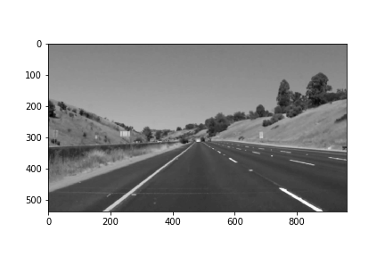
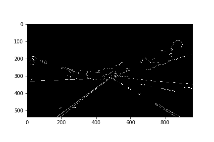
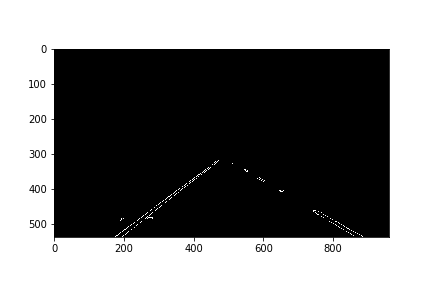
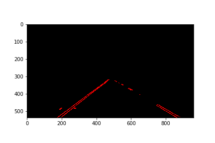
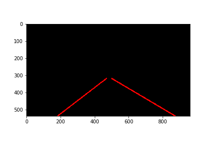
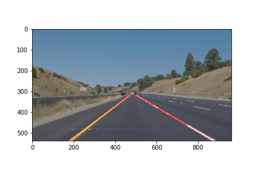

### Reflection - Finding Lane Lines on the Road

### 1. Pipline description

My pipline consisted of 6 steps

1. I converted the images to grayscale. The Hough transform method from the cv2 package requires the input image to be converted to grayscale. Color channels are often not needed in the computer vision related problems.


2. As the second step I applied the Gaussian blur to the image to remove the noise.



3. The next step was to use Canny detection to find the edges on the image.



4. Then I applied the mask to the edges image to limit the area of interest. Without this step there would be many lines unrelated to the lanes.



5. The next step was to apply the Hough transform to find the lines. Here I wanted to find not only long lines, but short as well.



6. In the final step I applied the Hough transform for the second time to create longer lines. I needed this step for the extrapolation. Without it the slope of short lines was not necessarily aligned with the slope of the longer lines. When I tried to filter out the short lines in the step no. 5, sometimes there were no lines at all.



To extrapolate the lines from the (second) Hough transform I created a new method ```draw_extrapolated_lines```. First it finds the slope of each line and classifies it as a left or right. Then it finds the average left and right slopes. The next step is to filter out the noise - the lines where the diffrence between their slope and the average is too large. If a line is not filtered out, its parameters are computed and its equation is used to draw the line on the image.



### 2. The shortcomings of the pipeline

1. The pipline is quite sensitive to the Hough transform paramters.
2. The solution feels a bit fragile because it uses a hardcoded height of the working area of the image. A small dislocation of the camera mounted on a car could destroy the whole pipline.
3. The pipline works quite well if the lanes are stright. If they are curved a bit more, the output is not correct (the challange problem).

### 3. Suggested improvements

To tackle the problem of curved lanes, the image partitioning could be done. To do this the pipline should split the image horizontally and find the lanes in each slice separately.

